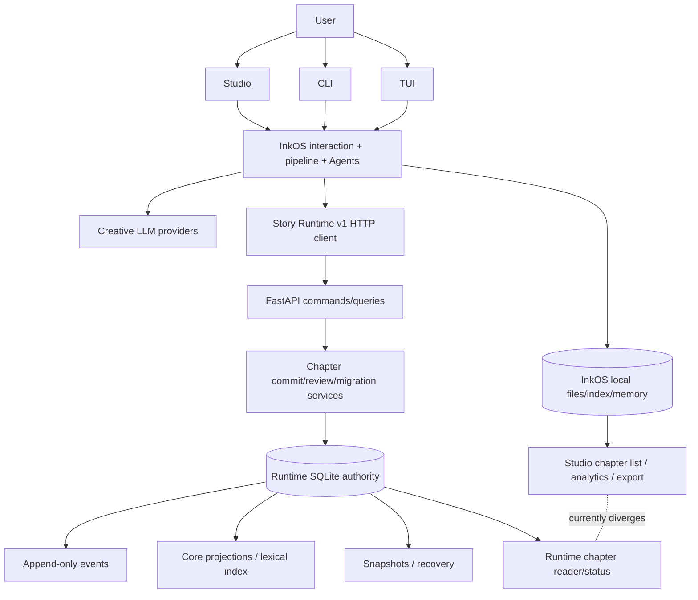

# FINAL AUDIT REPORT

审计日期：2026-07-13  
审计对象：`d727dd4cd0589bdb856046e92994fa8a5141ef46` 上的当前脏工作区快照  
最终判定：**NOT READY FOR PRODUCTION RELEASE**  
总分：**36 / 100**

## 1. Executive Summary

项目只完成了“融合内核”的重要一半，没有完成可发布产品闭环。

Story Runtime SQLite authority、章节 prepare/validate/commit 事务、幂等、事件与核心 projection replay、typed review 和 CIR migration 都有真实代码与测试，不是 README 空壳，也不是单纯把两个项目用 HTTP 接起来。response loss、并发 revision、projection fault、SQLite lock 等测试未发现未知半提交。

但产品层仍把 InkOS 本地 `chapters/index.json` 和 Markdown 当作章节列表、analytics、export 的实际来源。真实 Chromium 中，同一项目首页显示 `0 chapters`，Runtime 状态页显示 `revision 7 / latest chapter 3`。单章读取走 Runtime，列表和导出走本地文件，这是实质性的双产品事实源。

此外，`at_revision` 参数只拒绝未来 revision，实际仍返回当前 entity；post-cutover rollback 被实现明确拒绝；Runtime sidecar manager 没有接入 Studio/CLI；HEAD CI 当前失败且 Phase 9/release workflow 未跟踪；Agent read 可通过 symlink 读取 Runtime DB；依赖审计有 2 critical 和 25 high。

因此：

- 最初杂交目标：`PARTIAL`。
- 真正融合而非机械拼接：`PARTIAL`，内核融合、产品外围未融合。
- 双状态源问题：`FAIL`，产品章节读取/导出仍双源。
- 百万字能力：`PARTIAL`，规模已跑但关键 SLO 失败，且不是全产品 600 章生命周期。
- 正式发布条件：`FAIL`。

## 2. Final Verdict

**NOT READY FOR PRODUCTION RELEASE**

不是 `READY FOR LIMITED BETA`：当前问题包含错误导出/错误章节计数、伪历史查询、migration rollback 缺口、authority symlink 泄漏、critical dependencies 和失败 CI，均不适合外部 beta 数据承诺。

## 3. Score

| 领域 | 状态 | 得分/权重 |
|---|---|---:|
| 单一权威状态源 | FAIL | 0/15 |
| 章节事务和幂等 | PARTIAL | 12/15 |
| 事件、投影和恢复 | PARTIAL | 4/10 |
| 长期上下文和一致性 | PARTIAL | 4/10 |
| 审核与修订统一 | PARTIAL | 7/8 |
| Agent 权限和安全 | FAIL | 0/8 |
| 迁移可靠性 | PARTIAL | 4/8 |
| Studio/CLI/TUI 产品整合 | FAIL | 0/6 |
| 性能和百万字能力 | PARTIAL | 3/7 |
| 稳定性和灾备 | PARTIAL | 2/5 |
| 安装、升级和发布 | FAIL | 0/4 |
| CI、许可证和上游治理 | FAIL | 0/4 |

详见 `final-scorecard.md`。

## 4. Evidence

### 关键代码

- 写章主链：`inkos/packages/core/src/pipeline/runner.ts:875,1230`。
- Runtime persistence port：`chapter-persistence-port.ts:51`。
- authority transaction：`hybrid/story-runtime/src/story_runtime/chapter_commits.py:219-280`。
- Studio 本地章节列表：`inkos/packages/studio/src/api/server.ts:2816`。
- Studio Runtime 单章读取：`server.ts:2936-2951`。
- 本地文件 export：`inkos/packages/core/src/interaction/export-artifact.ts:68-118`。
- 伪 `at_revision`：`hybrid/story-runtime/src/story_runtime/api.py:276-280`。
- post-cutover rollback 拒绝：`migration_jobs.py:273-276`。
- lexical LIKE：`repository.py:122-151`。
- `/4` token 与 placeholder compression：`services.py:164,267-286`。
- Agent lexical path check：`agent-tools.ts:2386-2398`、`path-safety.ts:3-11`。
- process manager 无生产 caller：`process-manager.ts` 仅 index export/tests 搜索命中。

### 实际执行

- Runtime Python：107 passed。
- InkOS core：171 files、1545 tests passed（顺序复跑）。
- CLI：38 files、205 tests passed。
- Studio：58 files、497 tests passed。
- build：PASS。
- commit fault matrix：11/11 PASS。
- review E2E：1/1 PASS。
- migration：14/14 PASS。
- stability：8/8 PASS。
- million：1,096,328 chars、600 chapters、12,000 events；replay hash matched；lexical/commit SLO FAIL。
- short soak：72.187s、326 iterations、0 errors。
- Windows standalone：build、help、health PASS；不是 clean-machine install。
- Chromium：0 chapters vs Runtime latest 3，FAIL。
- Agent symlink attack：读取 `story.db` sentinel，FAIL。
- pnpm audit：95 vulnerabilities，2 critical、25 high，FAIL。
- GitHub Actions HEAD：failure；master 无 protection。

命令索引：`evidence/commands.md`。原始 benchmark/soak/package/Studio logs 位于 `evidence/`。

## 5. Critical Findings

### Blocker

1. **章节数据双 owner。** Runtime 保存 finalized body/revision，Studio list/analytics/export 仍信任本地 index/Markdown；已经产生用户可见冲突和错误导出风险。
2. **历史 revision 查询是伪实现。** `at_revision` 不参与 repository query，返回当前状态，触发红线 19。
3. **E2E 产品主链不成立。** commit 成功不能保证 Studio 列表与 export 找到正文。
4. **正式 CI 失败且关键 CI 未接线。** HEAD Runtime tests 2 fail；Phase 9/release YAML 未跟踪。
5. **Agent symlink authority read。** 路径黑名单基于 link name，未基于 realpath/handle。
6. **依赖存在 critical 漏洞。** `protobufjs` RCE 与 Vitest UI file read/execute，另有 25 high。

### Critical

1. migration post-cutover rollback 只报错要求人工停写，没有实现内 rollback。
2. Runtime sidecar lifecycle 未接 Studio/CLI，一键启动与版本 handshake 不是产品现实。
3. provenance legal status provisional，正式 source/SBOM/license bundle 未生成。
4. million lexical/normal commit P95 超过仓库 SLO。

### Major

1. context token 用字符 `/4`，中文不可靠；compression 只是 reference placeholder。
2. `StoryRuntimeModeSchema` 仍接受 `shadow`，与 CLI/Studio retired-mode policy 漂移。
3. Agent read 无输出上限，system-read feature flag 扩大泄漏面。
4. 6,274 行 Studio server 与 2,555 行 Agent tools 形成权限/所有权混杂。

### Minor

1. Studio build 有 2.53MB 主 chunk warning。
2. 根 `pnpm test` 在审计工具 244 秒上限超时；分包均单独通过。
3. 72 秒 soak 无 handle 计数，不能外推 24h。

### Informational

1. Python Runtime 没有创作 LLM/Claude Code 依赖。
2. response-loss retry、同 key 冲突、并发 revision、projection rollback 证据良好。
3. Runtime authority 不会静默 fallback 到 legacy write。

## 6. Unverified Areas

- macOS/Linux clean install 和 Runtime bundle。
- Windows clean VM 产品安装、签名、卸载。
- 24h soak 及原始 artifact。
- 真实 disk-full/ENOSPC、长时 WAL/log/snapshot growth。
- 完整产品 upgrade/downgrade/rollback 和 schema failure recovery。
- 正式 SBOM、gitleaks、pip-audit、release provenance attestation。
- vector/hybrid/rerank retrieval。
- 全产品 500+ 章逐章 Agent/review/commit/export lifecycle。
- upstream merge rehearsal、循环依赖与 unused dependency 专用分析。
- prompt injection 到 tool routing 的完整对抗 E2E。

这些项目没有被算作 PASS。

### 最终端到端验收逐步结果

| 要求步骤 | 状态 | 实际结果 |
|---|---|---|
| 全新安装 | NOT VERIFIED | 当前工作区构建，不是 clean machine |
| 启动 InkOS + Runtime | PARTIAL | 手动启动成功；不是产品一键 sidecar |
| 创建 Runtime authority 项目 | PASS（fixture/API） | deterministic seed/create service |
| 写第 1 章到 commit | PASS（Runtime E2E） | Phase 4/5 tests |
| review -> blocking -> revision -> stale -> re-review -> human -> commit | PASS（Runtime E2E） | Phase 5 1/1 |
| 查询新状态/后续多章 | PASS（Runtime fixture） | revision 7/latest chapter 3 |
| Runtime crash/restart | PASS（fault tests） | durable commit states |
| response loss retry | PASS | same commit/revision |
| projection failure/doctor/replay | PASS（integration） | recoverable projection |
| Studio 展示同一状态 | FAIL | 首页 0 chapters，Runtime latest 3 |
| backup/restore 新目录 | PASS（stability test） | projection hash matched |
| upgrade | NOT VERIFIED | 未执行完整产品 upgrade |
| migration/collision/cutover | PARTIAL | fixtures通过；post-cutover rollback FAIL |
| 查询历史 revision | FAIL | `at_revision` 返回当前 entity |
| 导出小说 | FAIL | export 读取 local index/Markdown，不能保证 Runtime body |
| 重启应用再打开/全 checksum | NOT VERIFIED | 产品 sidecar与导出已失败，未跳过失败点宣称全链通过 |

最终产品 E2E 在 Studio 状态一致性处明确失败；后续 upgrade/export/reopen 不能以独立 fixture 成功代替整条链成功。

## 7. Required Actions

### 发布前必须修复

1. 删除 Studio/list/analytics/export 对 Runtime authority book 的本地 chapter index/Markdown读取；所有 surface 使用统一 Runtime application service。
2. 实现真正的 revision-aware query/replay projection，增加跨 entity/relationship/thread/resource 的历史测试。
3. 实现并验证 post-cutover rollback 或明确将 cutover 设计为不可逆且在 cutover 前提供可执行产品级恢复；当前状态不能发布。
4. 对 Agent file tools 实施 realpath/handle containment、拒绝 symlink/reparse point、byte limits。
5. 修复 critical/high dependencies，正式 CI 运行并通过 audit。
6. 将 sidecar manager 接到产品启动/关闭、bundle selection、token/port handshake。
7. 提交并运行跨平台 CI/release gates；保护 master；release 必须依赖完整 CI。
8. 完成 legal provenance、SBOM、license/source bundle 验收。

### Beta 前修复

1. 使用目标模型 tokenizer；无 tokenizer 时采用中文安全上界。
2. 实现真实 summary compression，不返回占位符作为已压缩语义。
3. 达到或重新治理明确的 million SLO，不能静默降低门槛。
4. 跑 clean-machine install、disk-full、upgrade、24h soak。

### 后续优化

拆分 Studio server、Agent tools、pipeline runner 和 migration service；收敛 duplicate schemas/mode strings；建立 upstream sync rehearsal。

### 可接受限制

vector/rerank 可作为未配置能力，但产品必须准确标示 lexical/FTS，不得称完整高级 RAG。

## 8. Original Goal Comparison

| 原始目标 | 状态 | 比较 |
|---|---|---|
| InkOS 产品壳/Studio/CLI/TUI/Agent | PARTIAL | 能构建运行、surface 存在；Runtime lifecycle/章节显示未统一 |
| Python Story Runtime 内核 | PASS（内核） | authority/SQLite/event/commit/recovery/migration 有实质实现 |
| InkOS 多 Agent review/revision | PARTIAL | typed review 已统一；产品 E2E 未闭环 |
| webnovel 结构状态/事件/恢复/迁移思想 | PARTIAL | CIR/event/replay/snapshot实现；历史 revision 不成立 |
| 删除双写/冲突/宿主耦合/不可恢复缺陷 | FAIL | 写入 fail closed，但 chapter read/export 双源、sidecar未接、rollback缺失 |
| 百万字中文长篇 | PARTIAL | million corpus 已跑；SLO失败且不是完整创作链 |
| 状态唯一/可审计/恢复/迁移/升级 | PARTIAL | commit/replay/snapshot较强；产品双源、历史/升级缺口 |
| 不依赖 Claude Code | PASS | build/test/package不依赖 Claude Code |
| 不形成新“缝合怪” | FAIL | 内核不是空拼接，但产品外围 owner 未统一 |

InkOS 优点保留：产品 surfaces、多 Agent、provider、review UX。  
InkOS 缺点移除：Runtime authority 写入不再 Markdown bootstrap/legacy fallback。  
webnovel 优点保留：SQLite/CIR/events/replay/snapshot/idempotency。  
webnovel 缺点移除：Claude plugin/dashboard 未进入产品路径。  
新缺陷：SQLite 与本地 chapter surface 断裂、伪 `at_revision`、sidecar未接、symlink authority read。

## 9. Final Architecture Diagram



## 10. Data Ownership Matrix

| 数据 | 应有 owner | 当前实际 owner | 状态 |
|---|---|---|---|
| project revision/authority mode | Runtime SQLite | Runtime SQLite | PASS |
| finalized chapter body/checksum | Runtime SQLite | Runtime reader；local export另有副本路径 | FAIL |
| facts/entities/relationships/timeline/threads | Runtime SQLite | Runtime SQLite | PASS |
| events/commit transitions | Runtime SQLite | Runtime SQLite | PASS |
| core projections/FTS | Runtime reducer/index | Runtime | PASS |
| review artifact/human decision | Runtime review service | Runtime；legacy adapter import | PARTIAL |
| creative prompts/LLM config | InkOS | InkOS | PASS |
| Agent/session UI state | InkOS | InkOS | PASS |
| migration CIR/provenance | Runtime migration service | Runtime | PASS |
| backup/snapshot | Runtime operations | Runtime | PASS（产品 drill不足） |
| chapter list/analytics/export | 应由 Runtime application service | InkOS local index/Markdown | FAIL |

## 11. Runtime Call Graph

```text
Studio / CLI / TUI / Agent
  -> shared interaction action
  -> PipelineRunner._writeNextChapterLocked
  -> StoryRuntimeChapterPersistence.persist
  -> Runtime review validation
  -> POST prepare (request_id, idempotency_key, expected_revision)
  -> POST validate (body/artifact checksum, validation_token)
  -> POST commit
     -> SQLite transaction
        -> chapter blob/body
        -> deterministic events
        -> entities/relationships/facts/timeline/threads/summaries
        -> revision + transition audit
     -> outbox after authority transaction
  -> finalized response

Broken downstream reads:
  Studio list / analytics / export
  -> StateManager.loadChapterIndex + local Markdown
  -> does not read Runtime finalized chapter collection
```

## 12. Release Recommendation

立即停止 production release 候选流程。不要在当前基础上做文档性豁免，也不要把 Phase 9 未跟踪 workflow 当作门禁完成。

下一次验收应从四个 blocker 关闭开始：统一章节读取/导出 owner、真实历史 revision、Agent realpath 安全、产品 sidecar lifecycle；随后修复依赖和 CI，执行 migration rollback、clean install、disk-full、24h soak 和完整 deterministic product E2E。所有红线关闭后再重新评分。
