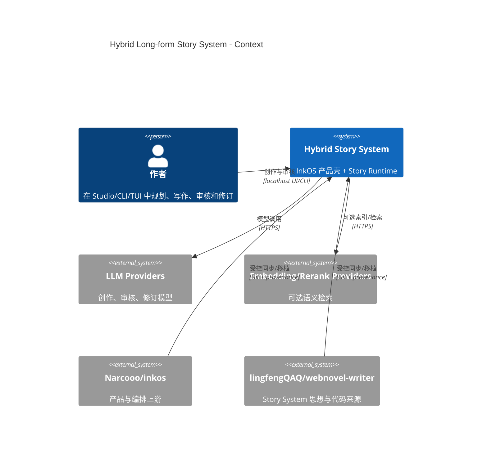
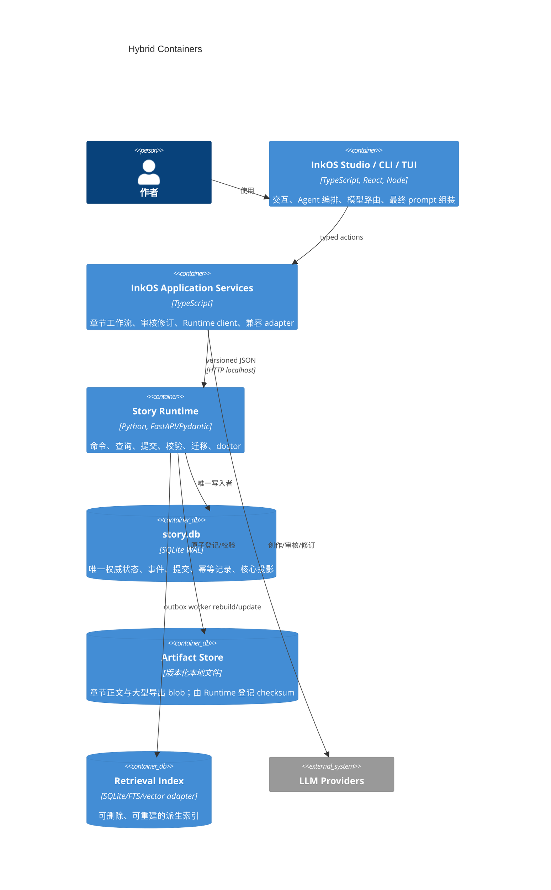
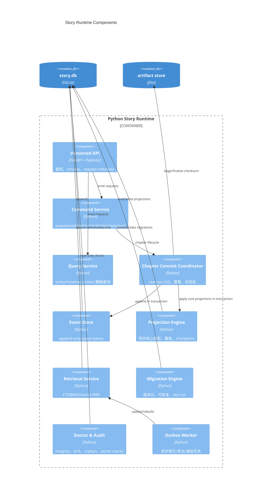
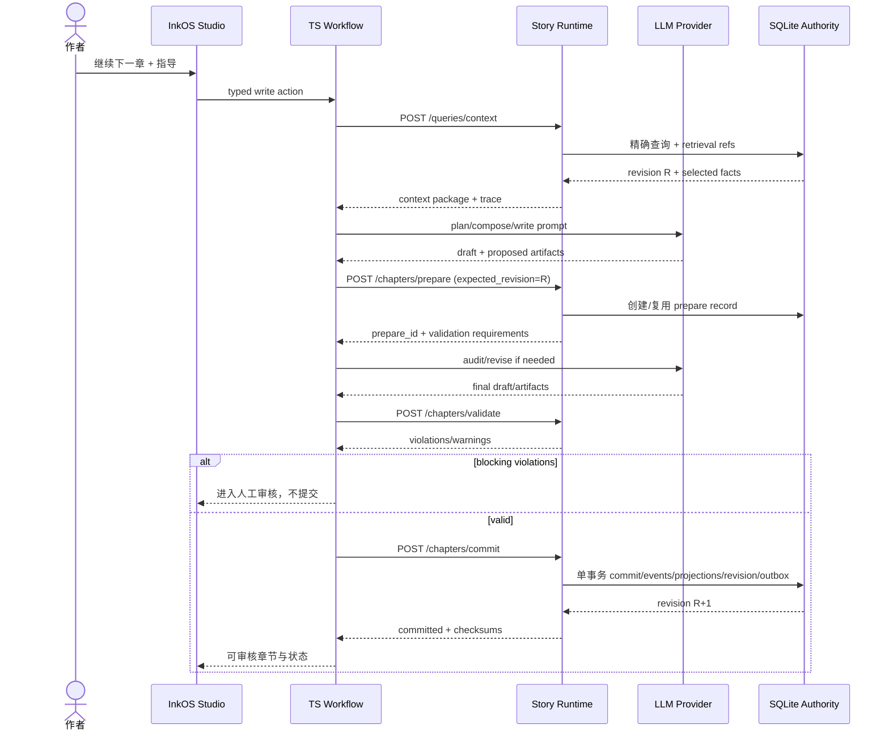
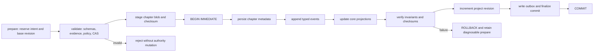
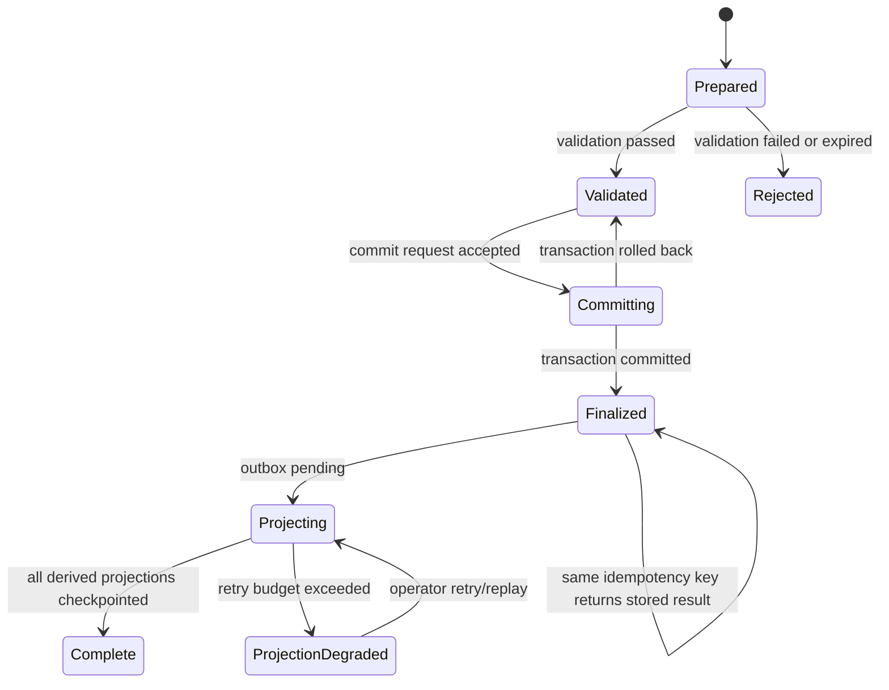

# 目标架构

## 1. 推荐架构摘要

采用 **InkOS modular monolith + local Python Story Runtime sidecar + single SQLite authority**。TypeScript 保留 UI、模型、Agent、prompt 和工作流；Python 独占长篇事实、事件、章节提交、投影、精确查询、RAG 和恢复。两者只通过版本化 JSON/HTTP 通信。

### C4 Context

### Container

### Component

## 2. 主要数据流

1. Studio 收集作者意图，Planner/Composer 请求 Runtime 的精确上下文和检索候选。
2. TypeScript 组装受治理 prompt，Writer 调 LLM 生成正文及候选 artifacts。
3. Agent 输出始终是未信任 proposal；Application 调 `prepare chapter` 得到 `prepare_id` 与基线 revision。
4. Runtime 校验 artifact、实体引用、时间线、outline fulfillment 与权限。
5. 审核/修订仍由 InkOS 完成；最终候选通过 `commit chapter` 提交。
6. Runtime 在一个 SQLite transaction 内完成 commit record、事件追加、核心投影、revision 更新、outbox 写入和 finalize。
7. RAG/vector、Markdown snapshot、Studio read model 由 outbox 异步构建；失败不会改变 authority revision，可重试。

## 3. 章节生成时序

## 4. 章节事务提交

核心投影（实体当前态、关系、时间线、伏笔、大纲执行、章节摘要索引）与事件同事务；vector、Markdown、EPUB 等可重建投影走 outbox。

## 5. 失败恢复

- 进程在事务前退出：prepare 可过期/重试，无 authority 变化。
- 事务中退出：SQLite rollback；同 idempotency key 重试。
- 事务后响应丢失：idempotency ledger 返回原 commit result。
- vector/Markdown 失败：authority 已完成，outbox 重试；doctor 明确显示 degraded projection。
- checksum 不符/orphan blob：doctor 隔离并从 commit revision 重建，不自动猜测事实。

## 6. Story Runtime API 边界

Runtime 对外只暴露 versioned DTO：

- Read：health、project status、query context、query entity、doctor。
- Command：prepare/validate/commit、append events（仅运维/受限）、replay projections、migrate、export snapshot。
- TypeScript 不得 `sqlite3`、不得读取 `.story-system` 内部文件、不得依赖表名。
- Runtime 不调用创作 LLM，不拥有 Studio session，不组装最终 prompt，不决定文风。
- 所有 command 带 `request_id`、`idempotency_key`、`project_id`、`schema_version`、`expected_revision`。
- 错误统一为 `code/message/retryable/current_revision/details`；409 表示 revision conflict，422 表示 schema/policy violation。

## 7. 数据所有权

| 数据 | 权威 owner | 存储 | 可编辑入口 | 派生/导出 |
|---|---|---|---|---|
| 人物/别名/属性历史 | Runtime Entity service | SQLite | typed command | roles Markdown、Studio DTO |
| 关系/势力 | Runtime Relationship service | SQLite events + projection | typed command | graph DTO/Markdown |
| 地点/装备/资源 | Runtime Entity service | SQLite | typed command | snapshot/RAG chunks |
| 时间线/事件 | Runtime Event Store | SQLite append-only | chapter commit/受限 admin append | timeline view |
| 伏笔/承诺/open loop | Runtime NarrativeThread | SQLite | events | hooks Markdown |
| 大纲版本与执行态 | Runtime Outline service | SQLite | InkOS Planner proposal → command | story_frame/volume_map export |
| 章节正文 | Runtime Artifact registry | versioned file/blob + SQLite checksum | chapter commit | TXT/MD/EPUB |
| 章节摘要 | Runtime core projection | SQLite | commit events | Markdown/RAG |
| 审核结果 | Runtime chapter artifact | SQLite/registered blob | InkOS Auditor proposal → validate | Studio review view |
| prompt/session/transcript | InkOS Application | TypeScript app storage | Studio/CLI/TUI | audit trace（脱敏） |
| 模型配置/secrets | InkOS config/secret service | env/secret file refs | Studio settings | Runtime 仅接 embedding secret ref |
| vector/BM25 | Runtime Retrieval | 派生索引 | worker only | 可删除重建 |
| Markdown truth/snapshot | Runtime Exporter | files | import/export command only | 非权威 |

## 8. Agent 权限模型

| 角色 | 可读 | 可提议 | 禁止 |
|---|---|---|---|
| Architect/Planner | project status、outline、constraints | outline version、chapter intent | 直接写 DB/Markdown authority |
| Composer | query-context 响应、trace | context selection feedback | 扫描 SQLite/任意项目文件 |
| Writer | 已批准 context package | chapter body、extraction candidates | append event、更新实体 |
| Auditor | body、authority facts、outline | issues/evidence | 修改正文或事实 |
| Reviser | body、issues、author guidance | revised body | 提交/覆盖 previous revision |
| Migration/Doctor worker | 受限项目数据 | migration/recovery report | 调 LLM、绕过 migration lock |
| Runtime command handler | schema 合法 command | 无 | 接受自由文本指令作为数据库操作 |

Agent 输出必须带来源、confidence、evidence spans 和 schema version。任何来自小说正文、外部资料或检索片段的文本都标记为 `untrusted_content`，不得解释成工具调用或持久化命令。

## 9. 配置分层

优先级从高到低：

1. Request-scoped non-secret overrides（有 allowlist）。
2. Book/project config（创作参数，不含明文 secret）。
3. Workspace config（Runtime URL、feature flags、compat mode）。
4. User config（provider defaults）。
5. Built-in defaults。

Secrets 通过 logical reference 解析，不进入 contracts、日志、snapshot 或 SQLite。Runtime 自有配置仅包括 DB/WAL/timeout/index 策略；创作模型配置归 TypeScript。

## 10. 未来扩展点

- SQLite authority 可通过 repository port 升级到 PostgreSQL，但 v1 不提前引入分布式复杂度。
- Retrieval port 支持 SQLite FTS、外部 vector store 或本地 embedding。
- Outbox consumer 可增加通知、云备份、EPUB、观察性导出。
- Contract version negotiation 支持多个 InkOS client 版本。
- Project federation/spinoff 通过显式 immutable canon snapshot/reference，不跨库直接 join。
- 多作者协作通过 command revision/lease 扩展，不改变 Agent 权限模型。

## 11. 被否决的备选架构

### 备选 A：Node 直接嵌入 Python/SQLite 代码或 TypeScript 直读表

否决。它破坏语言边界和独立演进，UI 会与表 schema 耦合，Python migrations 无法成为唯一门禁，也无法阻止 Agent/Studio 绕过事务服务。

### 备选 B：保留 InkOS JSON Truth 与 webnovel SQLite，靠同步器双向同步

否决。双主复制无法可靠解决冲突、崩溃窗口与 replay 顺序；百万字规模只会放大漂移，直接违反 Single Source of Truth。

### 备选 C：一次性把 InkOS 全部重写成 Python

否决。会丢失成熟 Studio/CLI/TUI 与 provider/Agent 生态，风险不可回滚，违反 No Big-bang Rewrite。

